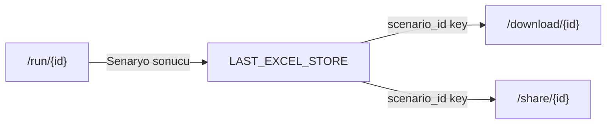
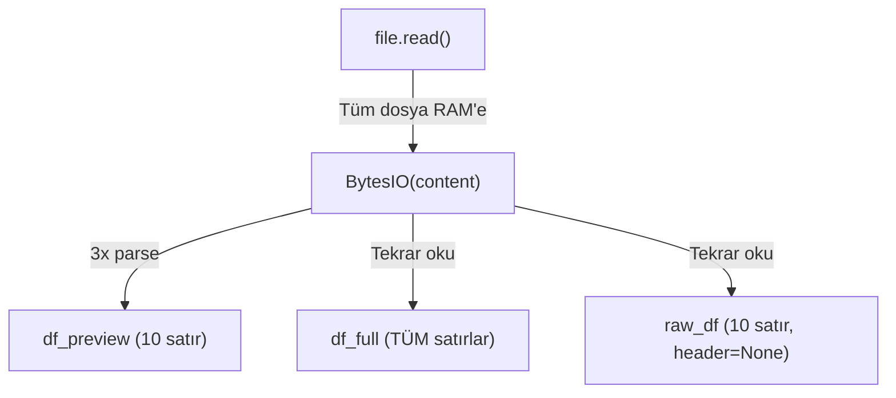

# Excel Studio Audit - Risk Haritası

> **FAZ 0:** Read-only Audit Report  
> **Tarih:** 2026-01-08  
> **Kapsam:** Bakım riskleri ve potansiyel sorunlar

---

## 1. In-Memory Store Riskleri

> [!CAUTION]  
> **KRİTİK RİSK:** Tüm in-memory store'lar server restart'ta kaybedilir. Production ortamında Redis/Database geçişi zorunludur.

### 1.1 LAST_EXCEL_STORE

| Özellik | Değer |
|---------|-------|
| **Dosya** | `backend/app/scenario_registry.py` |
| **Tanım Satırı** | Line 22 |
| **Kullanım** | `main.py` lines 17, 248, 250, 375, 381, 478, 484 |

**Kod Kanıtı:**
```python
# scenario_registry.py:22
LAST_EXCEL_STORE: Dict[str, Dict[str, Any]] = {}
```

**Kullanım Akışı:**



**Riskler:**

| Risk | Seviye | Açıklama |
|------|--------|----------|
| Memory Leak | 🔴 YÜKSEK | Cleanup mekanizması YOK - Store süresiz büyüyor |
| Data Loss | 🔴 YÜKSEK | Server restart = Tüm bekleyen indirmeler kaybedilir |
| Concurrency | 🟡 ORTA | Aynı scenario_id ile paralel çalıştırmalarda override |

**Optimizasyon Önerileri:**
1. **TTL ekle:** 30 dakika sonra otomatik temizle
2. **LRU Cache:** En az kullanılanı çıkar (max 100 entry)
3. **Redis geçişi:** Production için zorunlu

---

### 1.2 SHARE_STORE

| Özellik | Değer |
|---------|-------|
| **Dosya** | `backend/app/main.py` |
| **Tanım Satırı** | Line 461 |
| **Kullanım** | Lines 528, 537, 541, 544, 562, 565, 569 |

**Kod Kanıtı:**
```python
# main.py:461
SHARE_STORE: Dict[str, dict] = {}
SHARE_EXPIRY_SECONDS = 24 * 60 * 60  # 24 saat
```

**Cleanup Mekanizması:**
```python
# main.py:535-544 - Lazy cleanup (her POST'ta tetiklenir)
current_time = time.time()
expired_ids = [sid for sid, sdata in SHARE_STORE.items() 
               if current_time - sdata["created_at"] > SHARE_EXPIRY_SECONDS]
for sid in expired_ids:
    try:
        os.remove(SHARE_STORE[sid]["path"])  # Dosya silme
    except:
        pass
    del SHARE_STORE[sid]
```

**Riskler:**

| Risk | Seviye | Açıklama |
|------|--------|----------|
| Orphan Files | 🟡 ORTA | Memory temizlendi ama disk dosyası kaldı (exception) |
| Lazy Cleanup | 🟡 ORTA | Temizlik sadece yeni share POST'unda çalışır |
| File Path Exposure | 🟢 DÜŞÜK | `shared_files/` dizinine doğrudan erişim yok |

**Optimizasyon Önerileri:**
1. **Background task** ile periyodik cleanup
2. **Startup cleanup** - Server başlangıcında eski dosyaları temizle
3. **Redis + S3** geçişi production için

---

### 1.3 SCHEDULED_JOBS

| Özellik | Değer |
|---------|-------|
| **Dosya** | `backend/app/scheduled_reports_api.py` |
| **Tanım Satırı** | Line 16 |
| **Kullanım** | Lines 66, 86, 92, 121, 122, 131, 134, 142, 145, 146, 151, 161, 164, 177, 180, 185 |

**Kod Kanıtı:**
```python
# scheduled_reports_api.py:14-16
# Zamanlanmış görevleri saklamak için basit in-memory store
# Production'da Redis veya veritabanı kullanılmalı
SCHEDULED_JOBS: dict = {}
```

**API Endpoints:**

| Endpoint | Method | Açıklama |
|----------|--------|----------|
| `/viz/schedule/create` | POST | Yeni job oluştur |
| `/viz/schedule/list` | GET | Tüm jobları listele |
| `/viz/schedule/{job_id}` | GET | Tek job detayı |
| `/viz/schedule/{job_id}/toggle` | PUT | Enable/disable |
| `/viz/schedule/{job_id}` | DELETE | Job sil |
| `/viz/schedule/{job_id}/run-now` | POST | Hemen çalıştır |

**Riskler:**

| Risk | Seviye | Açıklama |
|------|--------|----------|
| Schedule Loss | 🔴 YÜKSEK | Server restart = Tüm zamanlamalar kaybolur |
| APScheduler Bağımlılığı | 🟡 ORTA | ImportError durumunda job sadece kaydedilir, çalışmaz |
| Duplicate Jobs | 🟢 DÜŞÜK | Timestamp-based ID çakışma riski düşük |

**Optimizasyon Önerileri:**
1. **SQLite/PostgreSQL** ile kalıcı job storage
2. **Celery Beat** veya **APScheduler jobstore** kullanımı
3. **Startup recovery** - DB'den job'ları yeniden yükle

---

## 2. /ui/inspect Endpoint Maliyeti

| Özellik | Değer |
|---------|-------|
| **Dosya** | `backend/app/ui_api.py` |
| **Tanım Satırları** | Lines 164-268 |
| **Endpoint** | `POST /ui/inspect` |

**Maliyet Analizi:**



**Bellek Kullanımı:**

| İşlem | Memory Kullanımı |
|-------|------------------|
| `content = await file.read()` | 1x dosya boyutu |
| `BytesIO(content)` - 1. read | +1x (pandas copy) |
| `BytesIO(content)` - 2. read | +1x (pandas copy) |
| `BytesIO(content)` - 3. read | +1x (pandas copy) |
| **Toplam Peak** | **~4x dosya boyutu** |

**Örnek:** 100 MB Excel → ~400 MB RAM gereksinimi

**Problemli Kod Bloğu:**
```python
# ui_api.py:187-218
content = await file.read()  # TÜM dosya RAM'e yüklenir

# 3 AYRI PARSE:
df_preview = pd.read_excel(BytesIO(content), ..., nrows=10)  # 1. parse
df_full = pd.read_excel(BytesIO(content), ...)              # 2. parse - FULL
raw_df = pd.read_excel(BytesIO(content), header=None, nrows=10)  # 3. parse
```

---

## 3. Optimizasyon Seçenekleri

### 3.1 LAST_EXCEL_STORE İçin

| Seçenek | Karmaşıklık | Etkililik | Öneri |
|---------|-------------|-----------|-------|
| TTL + MaxSize (in-memory) | Düşük | Orta | ✅ MVP için uygun |
| Redis + Serialization | Orta | Yüksek | ✅ Production için |
| Temp file + Cleanup task | Düşük | Orta | Memory sorunlarını çözer |

**MVP Implementasyon:**
```python
# Örnek TTL + MaxSize implementasyonu
import time
from collections import OrderedDict

class TTLStore:
    def __init__(self, max_size=100, ttl_seconds=1800):
        self._store = OrderedDict()
        self.max_size = max_size
        self.ttl = ttl_seconds
    
    def set(self, key, value):
        self._cleanup()
        self._store[key] = {"data": value, "ts": time.time()}
        if len(self._store) > self.max_size:
            self._store.popitem(last=False)
    
    def get(self, key):
        item = self._store.get(key)
        if item and time.time() - item["ts"] < self.ttl:
            return item["data"]
        return None
    
    def _cleanup(self):
        now = time.time()
        expired = [k for k,v in self._store.items() if now - v["ts"] > self.ttl]
        for k in expired:
            del self._store[k]
```

---

### 3.2 /ui/inspect İçin

| Seçenek | Karmaşıklık | Bellek Tasarrufu | Öneri |
|---------|-------------|------------------|-------|
| Streaming read | Orta | %75 | ✅ En iyi oran |
| Tek parse + tüm veriler | Düşük | %50 | ✅ Hızlı fix |
| Chunk-based preview | Yüksek | %90 | İleri seviye |

**Optimizasyon 1: Tek Parse**
```python
# DEĞİŞİKLİK: 3 parse yerine 1 parse
content = await file.read()

# TEK PARSE - Tüm ihtiyaçları karşıla
df_full = pd.read_excel(BytesIO(content), sheet_name=active_sheet, header=pandas_header)
df_preview = df_full.head(10)  # RAM'deki DF'den al

# Raw rows için header=None ile tekrar okumak yerine:
# index-based row access kullan
raw_rows = []
for idx in range(min(10, len(df_full))):
    raw_rows.append({"cells": [str(v) if pd.notna(v) else "" for v in df_full.iloc[idx].values]})
```

**Optimizasyon 2: File Size Limit**
```python
# Büyük dosyalar için uyarı
MAX_INSPECT_SIZE = 50 * 1024 * 1024  # 50 MB

content = await file.read()
if len(content) > MAX_INSPECT_SIZE:
    return {
        "warning": "Dosya çok büyük (>50MB). Preview limitli.",
        "columns": [],
        "row_count": "Unknown - dosya çok büyük"
    }
```

---

## 4. Risk Özeti

| Bileşen | Risk | Öncelik | Aksiyon |
|---------|------|---------|---------|
| LAST_EXCEL_STORE | Memory leak | 🔴 P0 | TTL + MaxSize ekle |
| SHARE_STORE | Orphan files | 🟡 P1 | Startup cleanup |
| SCHEDULED_JOBS | Data loss | 🔴 P0 | DB persistence |
| /ui/inspect | High memory | 🟡 P1 | Tek parse optimizasyonu |

---

## 5. Sonraki Adımlar

1. **Test Planı:** `EXCEL_STUDIO_SELFTEST_PLAN.md` - 10 kritik senaryo
2. **Golden Suite:** `EXCEL_STUDIO_GOLDEN_SUITE_PLAN.md` - 5 örnek dataset
3. **Implementasyon:** FAZ 1'de risk azaltma

---

*Bu doküman salt okunur denetim için oluşturulmuştur. Hiçbir kod değişikliği yapılmamıştır.*
