# Excel Studio Golden Suite Plan

> **FAZ 0:** Golden Dataset Test Planı  
> **Tarih:** 2026-01-08  
> **Kapsam:** 5 örnek dataset + expected hash formatı

---

## 1. Golden Suite Felsefesi

### 1.1 Ne İçin?

Golden suite testleri, **deterministik** ve **tekrarlanabilir** sonuçlar garanti eder:

- Regression detection: Kod değişikliği sonucu output değişti mi?
- SPSS parity: İstatistik sonuçları SPSS ile eşleşiyor mu?
- Cross-platform consistency: Windows/Linux/Mac aynı sonuç mu?

### 1.2 Hash-Based Verification

```mermaid
flowchart LR
    A[Input Dataset] --> B[Function Under Test]
    B --> C[Actual Output]
    C --> D[Hash/Checksum]
    D --> E{Expected Hash?}
    E -->|Match| F[✅ PASS]
    E -->|Mismatch| G[❌ FAIL]
```



---

## 2. 5 Örnek Dataset

### Dataset 1: Temel Sayısal Veri (GOLDEN_NUMERIC)

| Özellik | Değer |
|---------|-------|
| **Dosya Adı** | `golden_numeric.xlsx` |
| **Satır Sayısı** | 100 |
| **Sütun Sayısı** | 5 |
| **Seed** | 42 |
| **Kullanım** | Descriptive stats, T-Test, Correlation |

**Sütun Yapısı:**

| Sütun | Tip | Dağılım | Parametreler |
|-------|-----|---------|--------------|
| ID | Integer | Sequential | 1-100 |
| Value_A | Float | Normal | μ=50, σ=10 |
| Value_B | Float | Normal | μ=60, σ=15 |
| Group | Categorical | Uniform | ["Control", "Treatment"] |
| Score | Float | Normal with noise | μ=75, σ=12 |

**Veri Oluşturma Kodu:**

```javascript
// Deterministic data generation with seed=42
const seed = 42;
const n = 100;

function seededRandom(seed) {
    let state = seed;
    return function() {
        state = (state * 1664525 + 1013904223) % 4294967296;
        return state / 4294967296;
    };
}

const rand = seededRandom(seed);

function genNormal(mean, sd) {
    const u1 = rand();
    const u2 = rand();
    return mean + sd * Math.sqrt(-2 * Math.log(u1)) * Math.cos(2 * Math.PI * u2);
}

const data = [];
for (let i = 1; i <= n; i++) {
    data.push({
        ID: i,
        Value_A: genNormal(50, 10),
        Value_B: genNormal(60, 15),
        Group: rand() < 0.5 ? "Control" : "Treatment",
        Score: genNormal(75, 12)
    });
}
```

**Expected Hash Values:**

```json
{
    "dataset_id": "GOLDEN_NUMERIC",
    "version": "1.0.0",
    "row_count": 100,
    "column_hashes": {
        "Value_A_mean": "50.12345678",
        "Value_A_sd": "9.87654321",
        "Value_B_mean": "60.23456789",
        "Group_distribution": {"Control": 48, "Treatment": 52}
    },
    "checksum_md5": "a1b2c3d4e5f6..."
}
```

---

### Dataset 2: Kategorik Veri (GOLDEN_CATEGORICAL)

| Özellik | Değer |
|---------|-------|
| **Dosya Adı** | `golden_categorical.xlsx` |
| **Satır Sayısı** | 200 |
| **Sütun Sayısı** | 4 |
| **Seed** | 123 |
| **Kullanım** | Chi-Square, Crosstabs, Frequency |

**Sütun Yapısı:**

| Sütun | Tip | Dağılım | Değerler |
|-------|-----|---------|----------|
| ID | Integer | Sequential | 1-200 |
| Gender | Categorical | 45/55 | ["Male", "Female"] |
| Region | Categorical | 30/30/20/20 | ["North", "South", "East", "West"] |
| Preference | Categorical | 40/35/25 | ["A", "B", "C"] |

**Expected Crosstab:**

```json
{
    "test_id": "chi_square_gender_preference",
    "expected": {
        "chi_square": 3.456789,
        "df": 2,
        "p_value": 0.17823,
        "significant": false,
        "cramers_v": 0.1234
    },
    "tolerance": 1e-4
}
```

---

### Dataset 3: Eşleştirilmiş Veri (GOLDEN_PAIRED)

| Özellik | Değer |
|---------|-------|
| **Dosya Adı** | `golden_paired.xlsx` |
| **Satır Sayısı** | 30 |
| **Sütun Sayısı** | 3 |
| **Seed** | 789 |
| **Kullanım** | Paired T-Test, Repeated Measures |

**Sütun Yapısı:**

| Sütun | Tip | Açıklama |
|-------|-----|----------|
| Subject_ID | Integer | 1-30 |
| Pre_Score | Float | Önceki ölçüm (μ=70, σ=8) |
| Post_Score | Float | Sonraki ölçüm (Pre + effect + noise) |

**Effect Size:** Cohen's d ≈ 0.5 (orta etki)

**Expected Paired T-Test:**

```json
{
    "test_id": "paired_t_pre_post",
    "expected": {
        "t_statistic": -2.987654,
        "df": 29,
        "p_value": 0.00567,
        "mean_diff": -4.123,
        "ci_lower": -6.789,
        "ci_upper": -1.456,
        "cohens_d": 0.545,
        "significant": true
    },
    "tolerance": 1e-4
}
```

---

### Dataset 4: ANOVA Veri (GOLDEN_ANOVA)

| Özellik | Değer |
|---------|-------|
| **Dosya Adı** | `golden_anova.xlsx` |
| **Satır Sayısı** | 90 |
| **Sütun Sayısı** | 2 |
| **Seed** | 456 |
| **Kullanım** | One-Way ANOVA, Tukey HSD, Bonferroni |

**Sütun Yapısı:**

| Sütun | Tip | Açıklama |
|-------|-----|----------|
| Group | Categorical | ["A", "B", "C"] (30 each) |
| Value | Float | A:μ=50, B:μ=55, C:μ=60, σ=10 |

**Expected One-Way ANOVA:**

```json
{
    "test_id": "oneway_anova_groups",
    "expected": {
        "F_statistic": 8.765432,
        "df_between": 2,
        "df_within": 87,
        "p_value": 0.00034,
        "eta_squared": 0.1678,
        "omega_squared": 0.1456,
        "significant": true,
        "post_hoc": {
            "method": "bonferroni",
            "comparisons": [
                {"pair": "A-B", "diff": -5.12, "p_adj": 0.087, "sig": false},
                {"pair": "A-C", "diff": -10.34, "p_adj": 0.0001, "sig": true},
                {"pair": "B-C", "diff": -5.22, "p_adj": 0.078, "sig": false}
            ]
        }
    },
    "tolerance": {
        "F_statistic": 1e-4,
        "p_value": 1e-5,
        "effect_sizes": 1e-3
    }
}
```

---

### Dataset 5: Regresyon Veri (GOLDEN_REGRESSION)

| Özellik | Değer |
|---------|-------|
| **Dosya Adı** | `golden_regression.xlsx` |
| **Satır Sayısı** | 50 |
| **Sütun Sayısı** | 4 |
| **Seed** | 321 |
| **Kullanım** | Linear Regression, Multiple Regression |

**Sütun Yapısı:**

| Sütun | Tip | Açıklama |
|-------|-----|----------|
| X1 | Float | Predictor 1 (μ=0, σ=1) |
| X2 | Float | Predictor 2 (μ=0, σ=1) |
| X3 | Float | Predictor 3 (correlated with X1) |
| Y | Float | Outcome: Y = 2 + 3*X1 + 1.5*X2 + ε |

**True Model:** Y = 2 + 3X₁ + 1.5X₂ + ε (ε ~ N(0, 2))

**Expected Regression:**

```json
{
    "test_id": "multiple_regression",
    "expected": {
        "coefficients": {
            "intercept": 2.0,
            "X1": 3.0,
            "X2": 1.5
        },
        "r_squared": 0.85,
        "adj_r_squared": 0.84,
        "f_statistic": 132.456,
        "p_value": 1.23e-20,
        "standard_errors": {
            "intercept": 0.28,
            "X1": 0.19,
            "X2": 0.21
        }
    },
    "tolerance": {
        "coefficients": 0.5,
        "r_squared": 0.05,
        "p_value": 1e-10
    }
}
```

---

## 3. Expected Hash Format (JSON Schema)

```json
{
    "$schema": "http://json-schema.org/draft-07/schema#",
    "title": "Golden Expected Schema",
    "type": "object",
    "required": ["version", "datasets"],
    "properties": {
        "version": {
            "type": "string",
            "pattern": "^\\d+\\.\\d+\\.\\d+$"
        },
        "generated_at": {
            "type": "string",
            "format": "date-time"
        },
        "datasets": {
            "type": "array",
            "items": {
                "$ref": "#/definitions/DatasetExpected"
            }
        }
    },
    "definitions": {
        "DatasetExpected": {
            "type": "object",
            "required": ["id", "tests"],
            "properties": {
                "id": {"type": "string"},
                "description": {"type": "string"},
                "seed": {"type": "integer"},
                "row_count": {"type": "integer"},
                "tests": {
                    "type": "array",
                    "items": {"$ref": "#/definitions/TestExpected"}
                }
            }
        },
        "TestExpected": {
            "type": "object",
            "required": ["test_id", "function", "expected"],
            "properties": {
                "test_id": {"type": "string"},
                "function": {"type": "string"},
                "params": {"type": "object"},
                "expected": {"type": "object"},
                "tolerance": {
                    "oneOf": [
                        {"type": "number"},
                        {"type": "object"}
                    ]
                }
            }
        }
    }
}
```

---

## 4. Örnek golden_expected.json

```json
{
    "version": "1.0.0",
    "generated_at": "2026-01-08T14:30:00Z",
    "generator": "SPSS_PARITY_SUITE",
    "datasets": [
        {
            "id": "GOLDEN_NUMERIC",
            "description": "100 rows, 5 columns, seed=42",
            "seed": 42,
            "row_count": 100,
            "tests": [
                {
                    "test_id": "descriptive_stats_value_a",
                    "function": "runDescriptiveStats",
                    "params": {"column": "Value_A"},
                    "expected": {
                        "mean": 50.1234,
                        "sd": 9.8765,
                        "min": 25.432,
                        "max": 78.901,
                        "median": 50.001,
                        "skewness": 0.0123,
                        "kurtosis": -0.0456
                    },
                    "tolerance": 1e-3
                },
                {
                    "test_id": "independent_t_test_groups",
                    "function": "runIndependentTTest",
                    "params": {
                        "groupCol": "Group",
                        "valueCol": "Score"
                    },
                    "expected": {
                        "t": 2.345,
                        "df": 98,
                        "p": 0.0213,
                        "cohens_d": 0.467,
                        "ci_lower": 0.567,
                        "ci_upper": 7.234
                    },
                    "tolerance": {
                        "t": 1e-3,
                        "p": 1e-4,
                        "cohens_d": 1e-2
                    }
                },
                {
                    "test_id": "correlation_a_b",
                    "function": "runCorrelation",
                    "params": {
                        "col1": "Value_A",
                        "col2": "Value_B"
                    },
                    "expected": {
                        "r": 0.123,
                        "p": 0.223,
                        "n": 100,
                        "significant": false
                    },
                    "tolerance": 1e-3
                }
            ]
        },
        {
            "id": "GOLDEN_CATEGORICAL",
            "description": "200 rows, 4 columns, seed=123",
            "seed": 123,
            "row_count": 200,
            "tests": [
                {
                    "test_id": "chi_square_gender_region",
                    "function": "runChiSquareCrosstabs",
                    "params": {
                        "row": "Gender",
                        "col": "Region"
                    },
                    "expected": {
                        "chi2": 1.234,
                        "df": 3,
                        "p": 0.745,
                        "cramers_v": 0.078,
                        "significant": false
                    },
                    "tolerance": 1e-3
                }
            ]
        },
        {
            "id": "GOLDEN_PAIRED",
            "description": "30 subjects, pre/post design, seed=789",
            "seed": 789,
            "row_count": 30,
            "tests": [
                {
                    "test_id": "paired_t_test",
                    "function": "runPairedTTest",
                    "params": {
                        "col1": "Pre_Score",
                        "col2": "Post_Score"
                    },
                    "expected": {
                        "t": -2.987,
                        "df": 29,
                        "p": 0.00567,
                        "mean_diff": -4.123,
                        "cohens_d": 0.545
                    },
                    "tolerance": 1e-3
                }
            ]
        },
        {
            "id": "GOLDEN_ANOVA",
            "description": "3 groups x 30 subjects, seed=456",
            "seed": 456,
            "row_count": 90,
            "tests": [
                {
                    "test_id": "oneway_anova",
                    "function": "runOneWayANOVA_SPSS",
                    "params": {
                        "groupCol": "Group",
                        "valueCol": "Value"
                    },
                    "expected": {
                        "F": 8.765,
                        "df_between": 2,
                        "df_within": 87,
                        "p": 0.00034,
                        "eta_squared": 0.168,
                        "significant": true
                    },
                    "tolerance": {
                        "F": 1e-2,
                        "p": 1e-4,
                        "eta_squared": 1e-2
                    }
                }
            ]
        },
        {
            "id": "GOLDEN_REGRESSION",
            "description": "Multiple regression, true model known, seed=321",
            "seed": 321,
            "row_count": 50,
            "tests": [
                {
                    "test_id": "linear_regression",
                    "function": "runLinearRegression",
                    "params": {
                        "yCol": "Y",
                        "xCols": ["X1", "X2"]
                    },
                    "expected": {
                        "r_squared": 0.85,
                        "coefficients": {
                            "intercept": 2.0,
                            "X1": 3.0,
                            "X2": 1.5
                        },
                        "p_values": {
                            "X1": 1e-10,
                            "X2": 1e-5
                        }
                    },
                    "tolerance": {
                        "r_squared": 0.05,
                        "coefficients": 0.5
                    }
                }
            ]
        }
    ]
}
```

---

## 5. Test Runner Entegrasyonu

### 5.1 Mevcut selftest.js ile Entegrasyon

```javascript
// selftest.js içinde mevcut runGoldenSuite fonksiyonu
// golden_expected.json dosyasını yükle ve testleri çalıştır

async function runGoldenSuiteFromFile() {
    try {
        const response = await fetch('/js/golden_expected.json');
        const goldenData = await response.json();
        return runGoldenSuite(goldenData);
    } catch (e) {
        console.error('[GOLDEN] Failed to load golden_expected.json:', e);
        return { pass: 0, fail: 1, error: e.message };
    }
}

// URL parametresi ile tetikle: ?golden=1
if (new URLSearchParams(window.location.search).has('golden')) {
    runGoldenSuiteFromFile().then(results => {
        console.log('[GOLDEN SUITE RESULTS]', JSON.stringify(results, null, 2));
    });
}
```

### 5.2 Assertion Fonksiyonları

```javascript
// Mevcut assertion helpers (selftest.js:2689-2719)
function assertClose(actual, expected, tol, testId, msg = '') {
    const diff = Math.abs(actual - expected);
    if (diff > tol) {
        testResults.fail++;
        testResults.tests.push({ id: testId, status: 'FAIL', msg, actual, expected, diff });
    } else {
        testResults.pass++;
        testResults.tests.push({ id: testId, status: 'PASS' });
    }
}

function assertPValue(actual, expected, testId) {
    assertClose(actual, expected, TOLERANCES.pValue, testId, 'p-value mismatch');
}
```

---

## 6. CI/CD Entegrasyonu Önerisi

```yaml
# .github/workflows/golden-suite.yml
name: Golden Suite Tests

on:
  pull_request:
    paths:
      - 'frontend/js/modules/stats.js'
      - 'frontend/js/golden_expected.json'

jobs:
  golden-tests:
    runs-on: ubuntu-latest
    steps:
      - uses: actions/checkout@v3
      
      - name: Setup Node.js
        uses: actions/setup-node@v3
        with:
          node-version: '18'
      
      - name: Run Golden Suite
        run: |
          npm install puppeteer
          node scripts/run-golden-suite.js
      
      - name: Upload Results
        uses: actions/upload-artifact@v3
        with:
          name: golden-suite-results
          path: golden-results.json
```

---

## 7. Dataset Dosyaları Oluşturma

Dataset dosyalarını oluşturmak için Python scripti:

```python
# scripts/generate_golden_datasets.py
import pandas as pd
import numpy as np

def seeded_rng(seed):
    return np.random.default_rng(seed)

def generate_golden_numeric(seed=42):
    rng = seeded_rng(seed)
    n = 100
    return pd.DataFrame({
        'ID': range(1, n+1),
        'Value_A': rng.normal(50, 10, n),
        'Value_B': rng.normal(60, 15, n),
        'Group': rng.choice(['Control', 'Treatment'], n),
        'Score': rng.normal(75, 12, n)
    })

def generate_golden_categorical(seed=123):
    rng = seeded_rng(seed)
    n = 200
    return pd.DataFrame({
        'ID': range(1, n+1),
        'Gender': rng.choice(['Male', 'Female'], n, p=[0.45, 0.55]),
        'Region': rng.choice(['North', 'South', 'East', 'West'], n, p=[0.3, 0.3, 0.2, 0.2]),
        'Preference': rng.choice(['A', 'B', 'C'], n, p=[0.4, 0.35, 0.25])
    })

# ... diğer dataset generator'lar

if __name__ == '__main__':
    generate_golden_numeric().to_excel('test_data/golden_numeric.xlsx', index=False)
    generate_golden_categorical().to_excel('test_data/golden_categorical.xlsx', index=False)
    print("Golden datasets generated!")
```

---

## 8. Sonraki Adımlar

| Adım | Öncelik | Açıklama |
|------|---------|----------|
| 1. Dataset'leri SPSS'te çalıştır | 🔴 P0 | Gerçek expected değerleri al |
| 2. golden_expected.json doldur | 🔴 P0 | SPSS sonuçlarıyla |
| 3. selftest.js'ye entegre et | 🟡 P1 | ?golden=1 parametresi |
| 4. CI pipeline kur | 🟢 P2 | PR'larda otomatik çalıştır |

---

*Bu doküman salt okunur denetim için oluşturulmuştur. Hiçbir kod değişikliği yapılmamıştır.*
