# Excel Studio Selftest Plan - MVP Kapsamı

> **FAZ 0:** Test Planı Dokümanı  
> **Tarih:** 2026-01-08  
> **Kapsam:** En kritik 10 senaryo + 2 PRO pivot motoru

---

## 1. Test Stratejisi

### 1.1 Test Piramidi

```mermaid
pyramid
    title Test Coverage Stratejisi
    "E2E Browser Tests" : 2
    "Integration API Tests" : 3
    "Unit/Smoke Tests" : 10
```

### 1.2 Önceliklendirme Kriterleri

| Kriter | Ağırlık | Açıklama |
|--------|---------|----------|
| Kullanım Sıklığı | 40% | Hangi senaryolar en çok kullanılıyor |
| Hata Riski | 30% | Geçmişte bug rapor edilen alanlar |
| Veri Kaybı Riski | 20% | Kullanıcı verisini etkileme potansiyeli |
| Karmaşıklık | 10% | Kod karmaşıklığı ve bağımlılıklar |

---

## 2. En Kritik 10 Senaryo (MVP)

### Senaryo 1: Dosya Yükleme ve İnceleme

| Özellik | Değer |
|---------|-------|
| **Endpoint** | `POST /ui/inspect` |
| **Dosya** | `backend/app/ui_api.py:164-268` |
| **Öncelik** | 🔴 P0 - Kritik |
| **Risk** | Memory overflow büyük dosyalarda |

**Test Senaryoları:**

```yaml
T1.1_small_excel:
  input: 10x5 Excel dosyası
  expected:
    - columns: 5 sütun tespit edilmeli
    - row_count: 10
    - sheet_names: En az 1 sheet
    - preview_rows: 10 satır (tam dosya)

T1.2_large_excel:
  input: 100,000 x 20 Excel dosyası (~50 MB)
  expected:
    - Timeout olmamalı (< 30 saniye)
    - Memory leak yok (GC sonrası baseline'a dön)
    - columns: 20 sütun

T1.3_csv_with_encoding:
  input: UTF-8 BOM'lu CSV, Türkçe karakterler içeren
  expected:
    - Türkçe karakterler doğru okunmalı (ş, ğ, ü, ö, ç, ı)
    - columns: Header'lar encoding bozulmadan

T1.4_multi_sheet_excel:
  input: 5 sheet'li Excel
  expected:
    - sheet_names: ["Sheet1", "Sheet2", ...]
    - active_sheet: İlk sheet
    - Sheet değiştirince columns güncellenmeli
```

---

### Senaryo 2: Senaryo Çalıştırma (run_scenario)

| Özellik | Değer |
|---------|-------|
| **Endpoint** | `POST /run/{scenario_id}` |
| **Dosya** | `backend/app/main.py:99-357` |
| **Öncelik** | 🔴 P0 - Kritik |
| **Risk** | Runner exception = 500 error |

**Test Senaryoları:**

```yaml
T2.1_valid_scenario:
  input:
    scenario_id: "filter_rows"
    file: test_data.xlsx
    params: '{"column": "Status", "value": "Active"}'
  expected:
    - summary: İşlem tamamlandı mesajı
    - excel_available: true
    - download_url: "/download/filter_rows?format=xlsx"

T2.2_invalid_scenario_id:
  input:
    scenario_id: "nonexistent_scenario"
  expected:
    - status_code: 404
    - detail: "Senaryo bulunamadı"

T2.3_malformed_params:
  input:
    scenario_id: "filter_rows"
    params: "{INVALID JSON"
  expected:
    - status_code: 400
    - detail: "Parametreler geçersiz JSON formatında"

T2.4_runner_exception:
  input:
    scenario_id: "broken_scenario" (test için oluşturulacak)
  expected:
    - status_code: 500
    - detail: "Senaryo hatası: ..."
    - Hata server_debug.log'a yazılmış olmalı
```

---

### Senaryo 3: Dosya İndirme (download_result)

| Özellik | Değer |
|---------|-------|
| **Endpoint** | `GET /download/{scenario_id}` |
| **Dosya** | `backend/app/main.py:363-450` |
| **Öncelik** | 🔴 P0 - Kritik |
| **Risk** | LAST_EXCEL_STORE'da bulunamama |

**Test Senaryoları:**

```yaml
T3.1_xlsx_download:
  precondition: /run ile senaryo çalıştırılmış
  input:
    scenario_id: "filter_rows"
    format: "xlsx"
  expected:
    - Content-Type: application/vnd.openxmlformats...
    - Content-Disposition: attachment; filename="..."
    - Dosya açılabilir ve veri doğru

T3.2_csv_download:
  input:
    format: "csv"
  expected:
    - CSV BOM'lu UTF-8 encoding
    - Türkçe karakterler korunmuş

T3.3_json_download:
  input:
    format: "json"
  expected:
    - Valid JSON array
    - orient="records" formatında

T3.4_not_found:
  input:
    scenario_id: "never_ran"
  expected:
    - status_code: 404
    - detail: "Sonuç dosyası bulunamadı"
```

---

### Senaryo 4: Paylaşım Linki (share)

| Özellik | Değer |
|---------|-------|
| **Endpoint** | `POST /share/{scenario_id}` |
| **Dosya** | `backend/app/main.py:467-552` |
| **Öncelik** | 🟡 P1 |
| **Risk** | Orphan files, expiry doğrulaması |

**Test Senaryoları:**

```yaml
T4.1_create_share:
  precondition: /run ile sonuç oluşturulmuş
  expected:
    - share_id: 8 karakterlik UUID prefix
    - share_url: "/s/{share_id}"
    - expires_in: "24 saat"

T4.2_download_shared:
  input:
    share_id: T4.1'den dönen ID
  expected:
    - Dosya indirilmeli
    - Watermark eklenmeli: "Bu rapor Opradox ile oluşturuldu"

T4.3_expired_share:
  precondition: 24 saat geçmiş share (mock time)
  expected:
    - status_code: 410
    - detail: "Bu paylaşım linkinin süresi dolmuş"
```

---

### Senaryo 5: Zamanlanmış Raporlar

| Özellik | Değer |
|---------|-------|
| **Endpoint** | `/viz/schedule/*` |
| **Dosya** | `backend/app/scheduled_reports_api.py` |
| **Öncelik** | 🟡 P1 |
| **Risk** | SCHEDULED_JOBS persistence |

**Test Senaryoları:**

```yaml
T5.1_create_daily_schedule:
  input:
    name: "Günlük Satış Raporu"
    recipients: ["test@example.com"]
    schedule_type: "daily"
    schedule_time: "09:00"
    dashboard_id: "sales_dashboard"
  expected:
    - job_id: "report_YYYYMMDDHHMMSS"
    - next_run: Yarın 09:00

T5.2_list_schedules:
  expected:
    - jobs: Array
    - count: 1 (T5.1'den sonra)

T5.3_toggle_schedule:
  expected:
    - enabled: false (toggle sonrası)
    - message: "Rapor devre dışı bırakıldı"

T5.4_delete_schedule:
  expected:
    - success: true
    - SCHEDULED_JOBS'tan silinmiş olmalı
```

---

### Senaryo 6: UI Menu API

| Özellik | Değer |
|---------|-------|
| **Endpoint** | `GET /ui/menu` |
| **Dosya** | `backend/app/ui_api.py:93-133` |
| **Öncelik** | 🟢 P2 |
| **Risk** | Düşük - Sadece okuma |

**Test Senaryoları:**

```yaml
T6.1_turkish_menu:
  input:
    lang: "tr"
  expected:
    - text.search_placeholder: "Senaryo ara..."
    - categories: Object with category keys

T6.2_english_menu:
  input:
    lang: "en"
  expected:
    - text.search_placeholder: "Search scenario..."

T6.3_filter_by_status:
  input:
    status: "implemented"
  expected:
    - Sadece implemented senaryolar dönmeli
```

---

### Senaryo 7: Benzersiz Değerler (unique-values)

| Özellik | Değer |
|---------|-------|
| **Endpoint** | `POST /ui/unique-values` |
| **Dosya** | `backend/app/ui_api.py:272-318` |
| **Öncelik** | 🟢 P2 |
| **Risk** | Büyük datasette performans |

**Test Senaryoları:**

```yaml
T7.1_unique_values:
  input:
    file: test_data.xlsx
    column: "Status"
  expected:
    - values: ["Active", "Inactive", "Pending"]
    - total_count: 3

T7.2_column_letter:
  input:
    column: "A" (Excel harf kodu)
  expected:
    - İlk sütunun unique değerleri

T7.3_max_200_limit:
  input:
    file: 1000 unique değerli sütun
  expected:
    - values.length: <= 200
```

---

### Senaryo 8: Hata Yönetimi (Error Handling)

| Özellik | Değer |
|---------|-------|
| **Kapsam** | Tüm API'ler |
| **Öncelik** | 🔴 P0 |
| **Risk** | Unhandled exceptions |

**Test Senaryoları:**

```yaml
T8.1_corrupted_file:
  input:
    file: Bozuk Excel dosyası (random bytes)
  expected:
    - status_code: 400 veya 500
    - detail: Açıklayıcı hata mesajı

T8.2_missing_required_params:
  input:
    /run/{id} - file parameter olmadan
  expected:
    - status_code: 422
    - Validation error detayı

T8.3_content_type_mismatch:
  input:
    Content-Type: application/json (file upload yerine)
  expected:
    - status_code: 415 veya 422
```

---

### Senaryo 9: Concurrent Request Handling

| Özellik | Değer |
|---------|-------|
| **Kapsam** | LAST_EXCEL_STORE, SHARE_STORE |
| **Öncelik** | 🟡 P1 |
| **Risk** | Race condition |

**Test Senaryoları:**

```yaml
T9.1_parallel_runs:
  input:
    - 5 paralel /run isteği (aynı scenario_id)
  expected:
    - Son başarılı run sonucu LAST_EXCEL_STORE'da
    - Çakışma veya corrupt data yok

T9.2_parallel_downloads:
  input:
    - 10 paralel /download isteği
  expected:
    - Tümü başarılı (429 rate limit değilse)
```

---

### Senaryo 10: Sheet ve Header Row Seçimi

| Özellik | Değer |
|---------|-------|
| **Endpoint** | `POST /run/{id}`, `POST /ui/inspect` |
| **Öncelik** | 🟡 P1 |
| **Risk** | Merge header hücreleri atlama |

**Test Senaryoları:**

```yaml
T10.1_custom_header_row:
  input:
    header_row: 2 (3. satır header)
  expected:
    - İlk 2 satır atlanmış
    - columns: 3. satırdaki değerler

T10.2_select_specific_sheet:
  input:
    sheet_name: "Sheet2"
  expected:
    - active_sheet: "Sheet2"
    - Sheet2 verileri dönmeli

T10.3_crosssheet_lookup:
  input:
    Ana dosya Sheet1, df2 olarak Sheet2 kullanımı
  expected:
    - İki sheet arası VLOOKUP çalışmalı
```

---

## 3. PRO Pivot Motorları (2 Test)

### PRO-1: Visual Builder Pivot Table

| Özellik | Değer |
|---------|-------|
| **Dosya** | `frontend/js/visualBuilder.js` |
| **Fonksiyon** | Pivot table generation |
| **Öncelik** | 🔴 P0 - PRO özellik |

**Test Senaryoları:**

```yaml
PRO1.1_basic_pivot:
  input:
    rows: ["Category"]
    columns: ["Region"]
    values: ["Sales"]
    aggregation: "sum"
  expected:
    - Pivot tablo render edilmeli
    - Toplam değerler doğru hesaplanmış

PRO1.2_multi_aggregation:
  input:
    values: ["Sales", "Quantity"]
    aggregations: ["sum", "avg"]
  expected:
    - Her combination için 2 değer

PRO1.3_filter_then_pivot:
  input:
    Filter: Year = 2023
    Pivot: Category x Region
  expected:
    - Sadece 2023 verisi pivotlanmış
```

---

### PRO-2: Statistics Engine (Pivot + ANOVA)

| Özellik | Değer |
|---------|-------|
| **Dosya** | `frontend/js/modules/stats.js` |
| **Fonksiyon** | `runOneWayANOVA_SPSS`, `runPivotAnalysis` |
| **Öncelik** | 🔴 P0 - PRO özellik |

**Test Senaryoları:**

```yaml
PRO2.1_anova_with_pivot:
  input:
    groupCol: "Treatment"
    valueCol: "Score"
  expected:
    - F-value hesaplanmış
    - p-value < 0.05 ise significant
    - PostHoc: Bonferroni comparisons

PRO2.2_pivot_summary_stats:
  input:
    rows: ["Group"]
    values: ["Value"]
    stats: ["mean", "sd", "n"]
  expected:
    - Her grup için mean, sd, n
    - Grand total satırı
```

---

## 4. Test Execution Plan

### 4.1 Test Ortamı

| Bileşen | Araç |
|---------|------|
| Backend API Tests | pytest + httpx |
| Frontend Unit Tests | Jest veya Mocha |
| E2E Tests | Browser selftest (`?selftest=1`) |

### 4.2 Execution Sırası

```mermaid
gantt
    title Selftest Execution Plan
    dateFormat X
    axisFormat %s

    section P0 Critical
    T1 File Inspect     :0, 10
    T2 Run Scenario     :10, 20
    T3 Download         :20, 30
    T8 Error Handling   :30, 40

    section P0 PRO
    PRO1 Pivot Table    :40, 50
    PRO2 Stats Engine   :50, 60

    section P1 Important  
    T4 Share            :60, 70
    T5 Scheduled        :70, 80
    T9 Concurrent       :80, 90
    T10 Sheet Selection :90, 100

    section P2 Nice-to-have
    T6 UI Menu          :100, 105
    T7 Unique Values    :105, 110
```



---

## 5. Coverage Hedefleri

| Metric | Hedef | Açıklama |
|--------|-------|----------|
| API Endpoint Coverage | 100% | Tüm endpoint'ler en az 1 test |
| Happy Path Coverage | 100% | Normal akış |
| Error Path Coverage | 80% | Hata senaryoları |
| Edge Case Coverage | 60% | Sınır koşulları |

---

## 6. Sonraki Adımlar

1. ✅ Test planı oluşturuldu (bu doküman)
2. ⏳ Golden Suite dataset'leri hazırla
3. ⏳ pytest fixture'ları oluştur
4. ⏳ Browser selftest kapsamını genişlet

---

*Bu doküman salt okunur denetim için oluşturulmuştur. Hiçbir kod değişikliği yapılmamıştır.*
